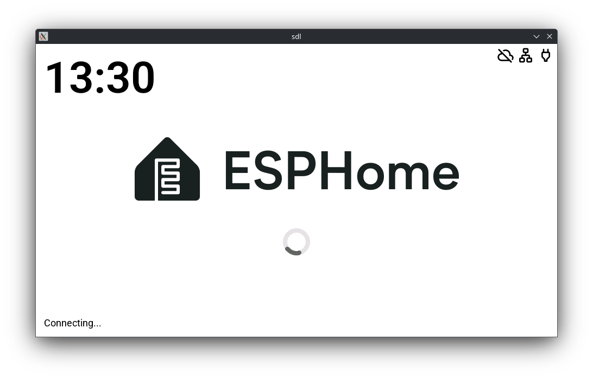
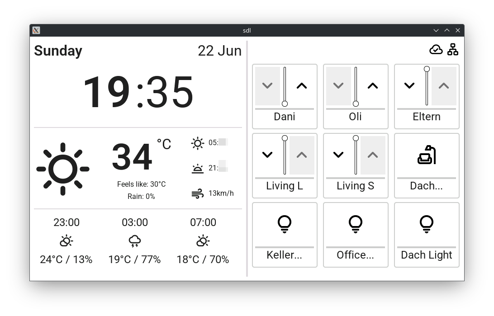
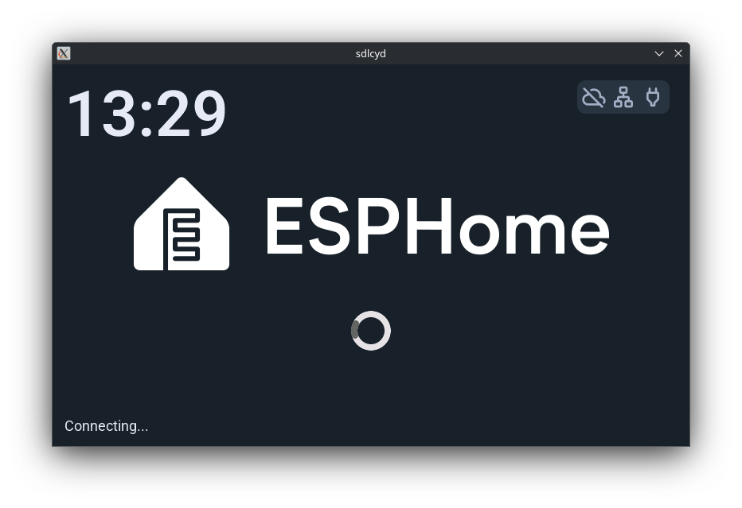
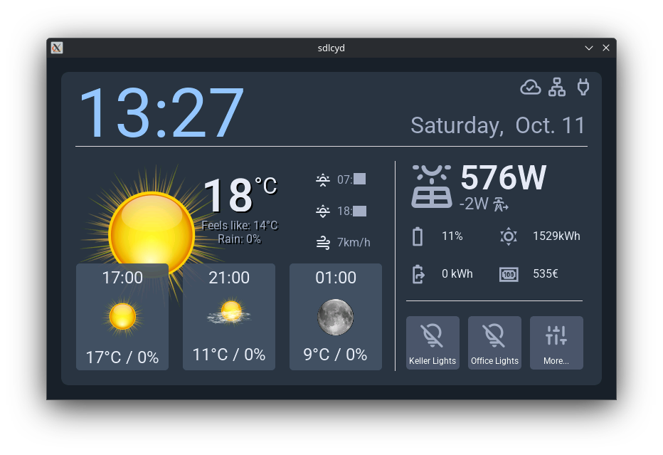

# ESPHome Configs

This repository contains ESPHome configurations for various devices:
- M5Paper
- CYD (Cheap Yellow Display)
- ~~M5Dial (Knob)~~ (TODO)
- M5Paper SDL (simulates M5Paper display / layout)
- CYD SDL (simulates CYD display / layout)
- ~~M5Dial SDL (simulates M5Dial / layout)~~ (TODO)

# Screenshots

Helper sensors are required on Home Assistant side. See [home-assistant-templates/.yaml] for examples.

## M5Paper / M5Paper SDL

## CYD / CYD SDL

# License

This project is licensed under the [MIT License](LICENSE).

Feel free to use and modify the configs or helper code for any purpose.
If you find them useful, a mention or a pull request is always appreciated!

Contains 3rd party assets:
* [Material Symbols Rounded font](assets/3rdparty/msr/REPO.md), licensed under [Apache License 2.0](assets/3rdparty/msr/LICENSE)
* [Material Design Icons](assets/3rdparty/mdi/REPO.md), licensed under [Pictogrammers Free License](assets/3rdparty/mdi/LICENSE)
* [KDE Oxygen Weather Icons](assets/3rdparty/oxygen/REPO.md), licensed under [LGPLv3](assets/3rdparty/oxygen/COPYING)
* [Photorealistic weather icons v2, by Apexxx_Sensei](assets/3rdparty/da/REPO.md), licensed under [CC BY-NC-ND 3.0](https://creativecommons.org/licenses/by-nc-nd/3.0/)
* [Deejayfool/hass-shutter-card](assets/3rdparty/sc/REPO.md), licensed under [Apache License v2.0](assets/3rdparty/sc/LICENSE)

# Acknowledgments

This wouldn't have been possible without the many great esphome examples, documentation,
and forum posts. Special thanks to the ESPHome community for making their knowledge and
expertise available.
