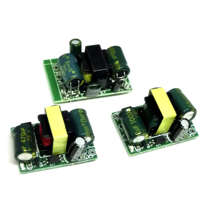

# Mechanical Parts

## ⚠️ Safety Warning

**DANGER: MAINS VOLTAGE**

Some devices in this project may require connection to mains voltage (110V/230V AC). Working with mains voltage is **extremely dangerous** and can result in:
- **Electric shock**
- **Serious injury or death**
- **Fire hazards**
- **Damage to equipment**

**Before working with any mains-powered device:**
- If you are not qualified to work with mains voltage, **do not attempt it**
- Always disconnect power before working on any circuit
- Use proper isolation and safety equipment
- Follow local electrical codes and regulations
- Consider having a qualified electrician perform any mains voltage work

**You assume all responsibility and risk.** The authors of this project accept no liability for any injury, death, or damage
resulting from the use of these configurations.

## CYD Wallmount

To mount the CYD on the wall in a standard 68mm EU electrical box, you can use the provided mounting bracket and display case.

The mounting screws are 60mm apart and the case should fit a [Kaiser 9064-02 box](https://www.kaiser-elektro.de/de_DE/produkte/elektro-installation/hohlwand/geraetedosen-geraete-verbindungsdosen-zubehoer/141/geraete-verbindungsdose-o-range-tiefe-62-mm).

The fixed wall part is designed to fit a 220VAC to 5VDC power supply like [this one](https://de.aliexpress.com/item/4000820532219.html),
with measurements of roughly 2cm x 3cm x 2cm.

The mounting holes are made to fit M3 heat-inserts and M3 screws. Based on your printer and its tolerances, you may need to
adjust the model.

For connecting the CYD to 5VDC in the wallbox, you need a female 4-pin 1.25mm JST connector. Between the CYD and AC-DC
converter, you can fit an appropriate 2-pin cable to cable connector to allow disconnecting and removing the display from
the wall.

The USB-C connector is exposed, so the device can be re-programmed without removing the display from the wall, though having
power supplied on both USB-C port and the power connector may cause issues.

This model fits the [CYD ESP32-8048S070 display](https://www.espboards.dev/esp32/cyd-esp32-8048s070/).

Model: [cyd-wallmount.FCStd](cyd-wallmount.FCStd)
STLs:
* [Top case](stl/cyd-wallmount-case-top.stl)
* [AC/DC Converter Plate](stl/cyd-wallmount-converter-plate.stl)
* [Wall Faceplate](stl/cyd-wallmount-faceplate.stl)
* [Screen Backplate](stl/cyd-wallmount-screen-backplate.stl)
